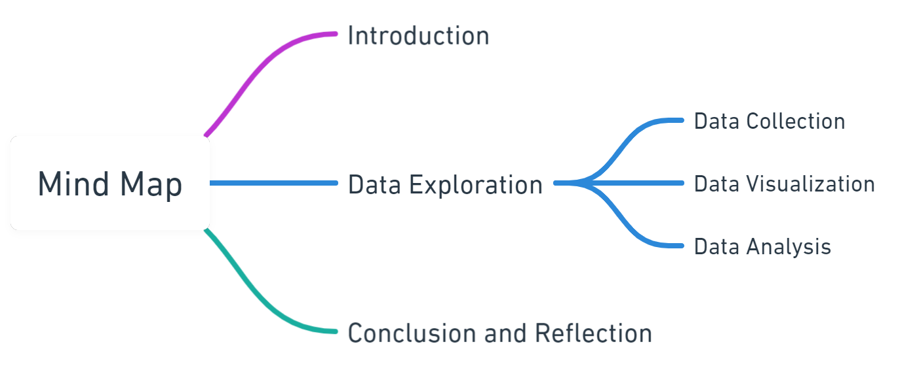
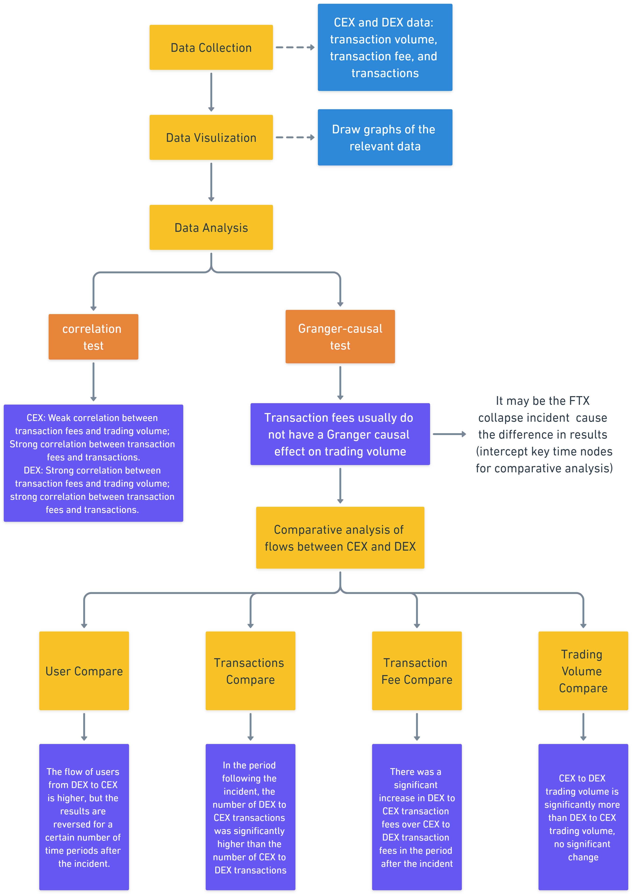
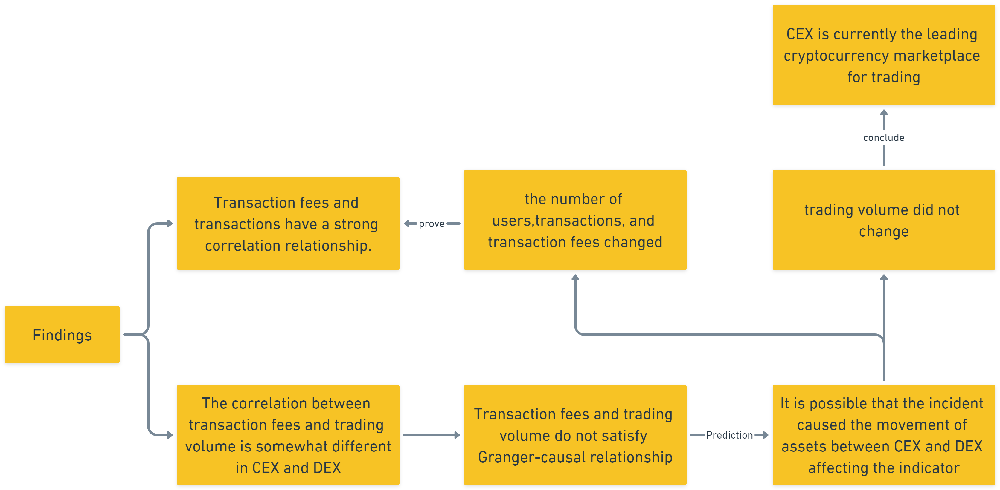
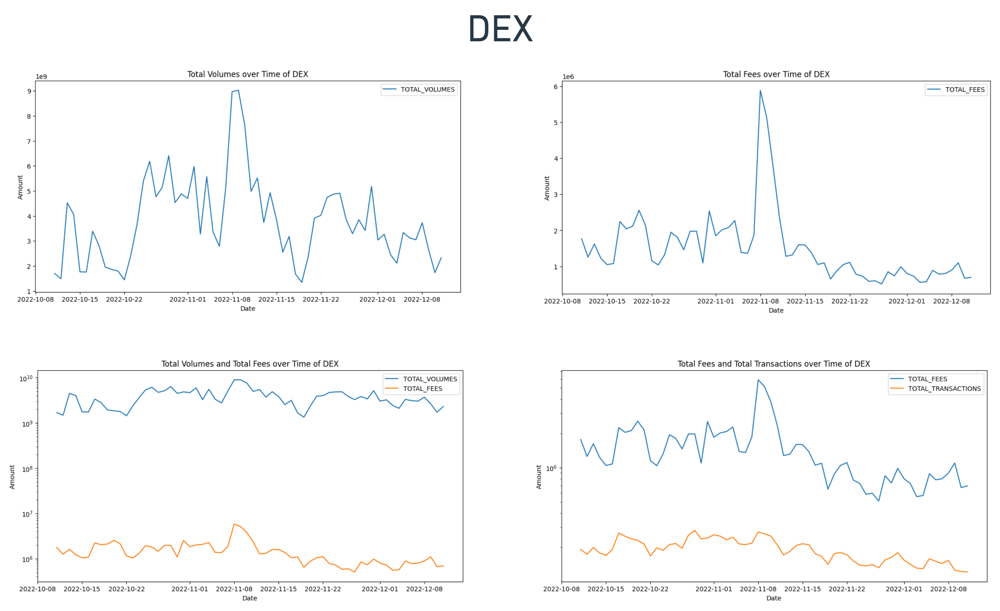
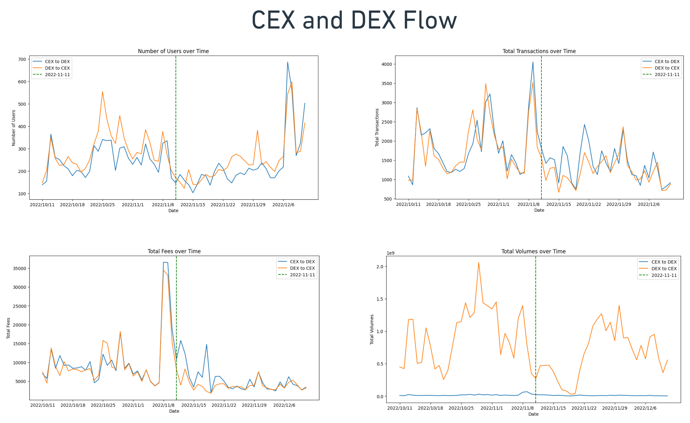

# Exploring Centralized and Decentralized Cryptocurrency Exchanges - Analyzing ETH Token Trading on Centralized and Decentralized Cryptocurrency Exchanges
## Project information
- **Author**: Xintong Wu, Computation and Design, Class of 2025, Duke Kunshan University
- **Instructor**: Prof. Luyao Zhang, Duke Kunshan University
- **Disclaimer**: Submissions to the SciEcon Innovate for SRS 2023 instructed by Prof. Luyao Zhang at Duke Kunshan University.
- **Acknowledgments**: My sincere appreciation to SciEcon Insights and its directors: Prof. Luyao Zhang, Xinyu Tian, Wanlin Deng, Zesen Zhuang, and Xintong WU.
- **Project Summary**: 
  This project takes the ETH token as an example. It selects two months before and after the FTX collapse as the time nodes to analyze the transaction indicators such as transaction volume (in USD), transaction fees, and transactions in CEX and DEX, investigate the correlation between the indicators, explore users' preference for CEX and DEX, and provide the development direction for future cryptocurrency exchanges. First, this research analyzed the ETH token flow of CEX and DEX, considering the migration in both inflow and outflow directions, and presented the changes of each transaction indicator over time by drawing a graph. Then, it performed the correlation test and Granger causality test (Engle and C. W. J. Granger 1987) (Ante and Saggu 2023) for the data analysis of the trading indicators therein. Also, the analysis of liquid trading between CEX and DEX focused on the changes in trading indicators before and after the FTX collapse incident. Finally, it summarized the results obtained from the above study to provide a comprehensive overview of the trading situation of CEX and DEX and analyze the future direction of cryptocurrency exchanges. This study helps users understand the cryptocurrency market better and supports informed decision-making by examining the trends between the CEX and DEX platforms and their distribution.

## Table of Contents
- [Data](https://github.com/SciEcon/SRS2023_cex_dex/blob/main/README.md#data)
- [Code](https://github.com/SciEcon/SRS2023_cex_dex/blob/main/README.md#code)
- [Spotlight](https://github.com/SciEcon/SRS2023_cex_dex/blob/main/README.md#spotlight)
- [More about the Author](https://github.com/SciEcon/SRS2023_cex_dex/blob/main/README.md#more-about-the-author)
- [References](https://github.com/SciEcon/SRS2023_cex_dex/blob/main/README.md#references)


## Data
- Data Source: https://flipsidecrypto.xyz/

### Meta Data Infomation

| Data Files  | Data Type | Data Content |
| ------------- | ------------- | ------------- |
| [cex_inflow](https://github.com/SciEcon/SRS2023_cex_dex/blob/main/data/Queried_Data/cex_inflow.csv) | Queried_Data | CEX inflow data |
| [cex_outflow](https://github.com/SciEcon/SRS2023_cex_dex/blob/main/data/Queried_Data/cex_outflow.csv) | Queried_Data | CEX outflow data |
| [dex_inflow](https://github.com/SciEcon/SRS2023_cex_dex/blob/main/data/Queried_Data/dex_inflow.csv) | Queried_Data | DEX inflow data |
| [dex_outflow](https://github.com/SciEcon/SRS2023_cex_dex/blob/main/data/Queried_Data/dex_outflow.csv) | Queried_Data | DEX outflow data |
| [cex_to_dex_query](https://github.com/SciEcon/SRS2023_cex_dex/blob/main/data/Queried_Data/cex_to_dex_query.csv) | Queried_Data | CEX to DEX flow data |
| [dex_to_cex_query](https://github.com/SciEcon/SRS2023_cex_dex/blob/main/data/Queried_Data/dex_to_cex_query.csv) | Queried_Data | DEX to CEX flow data |
| [cex_process](https://github.com/SciEcon/SRS2023_cex_dex/blob/main/data/Processed_Data/cex_process.csv) | Processed_Data | CEX's total transaction data |
| [dex_process](https://github.com/SciEcon/SRS2023_cex_dex/blob/main/data/Processed_Data/dex_process.csv) | Processed_Data | DEX's total transaction data |

### Data Dictionary

| File Name  | Variable Name | Description | Frecuency | Unit | Type |
| ------------- | ------------- | ------------- | ------------- | ------------- | ------------- |
|[cex_inflow](https://github.com/SciEcon/SRS2023_cex_dex/blob/main/data/Queried_Data/cex_inflow.csv)| Date | date | daily | 1 day | int |
|  | USD_VOLUMES | transaction volumes | daily | USD | float |
|  | FEES | transaction fees | daily | USD | float |
|  | TOTAL_TRANSACTIONS | transaction | daily | 1 | int |
|[cex_outflow](https://github.com/SciEcon/SRS2023_cex_dex/blob/main/data/Queried_Data/cex_outflow.csv)| Date | date | daily | 1 day | int |
|  | USD_VOLUMES | transaction volumes | daily | USD | float |
|  | FEES | transaction fees | daily | USD | float |
|  | TOTAL_TRANSACTIONS | transaction | daily | 1 | int |
|[dex_inflow](https://github.com/SciEcon/SRS2023_cex_dex/blob/main/data/Queried_Data/dex_inflow.csv)| Date | date | daily | 1 day | int |
|  | USD_VOLUMES | transaction volumes | daily | USD | float |
|  | FEES | transaction fees | daily | USD | float |
|  | TOTAL_TRANSACTIONS | transaction | daily | 1 | int |
|[dex_outflow](https://github.com/SciEcon/SRS2023_cex_dex/blob/main/data/Queried_Data/dex_outflow.csv)| Date | date | daily | 1 day | int |
|  | USD_VOLUMES | transaction volumes | daily | USD | float |
|  | FEES | transaction fees | daily | USD | float |
|  | TOTAL_TRANSACTIONS | transaction | daily | 1 | int |
| [cex_to_dex_query](https://github.com/SciEcon/SRS2023_cex_dex/blob/main/data/Queried_Data/cex_to_dex_query.csv) |Date | date | daily | 1 day | int |
|  | NUM_USERS | the number of users | daily | 1 | int |
|  | TOTAL_USD_VOLUMES | total transaction volumes | daily | USD | float |
|  | TOTAL_FEES | total transaction fees | daily | USD | float |
|  | TOTAL_TRANSACTIONS | total transactions | daily | 1 | int |
| [dex_to_cex_query](https://github.com/SciEcon/SRS2023_cex_dex/blob/main/data/Queried_Data/dex_to_cex_query.csv) |Date | date | daily | 1 day | int |
|  | NUM_USERS | the number of users | daily | 1 | int |
|  | TOTAL_USD_VOLUMES | total transaction volumes | daily | USD | float |
|  | TOTAL_FEES | total transaction fees | daily | USD | float |
|  | TOTAL_TRANSACTIONS | total transactions | daily | 1 | int |
|[cex_process](https://github.com/SciEcon/SRS2023_cex_dex/blob/main/data/Processed_Data/cex_process.csv)| Date | date | daily | 1 day | int |
|  | USD_VOLUMES | transaction volumes | daily | USD | float |
|  | FEES | transaction fees | daily | USD | float |
|  | TOTAL_TRANSACTIONS | transaction | daily | 1 | int |
|[dex_process](https://github.com/SciEcon/SRS2023_cex_dex/blob/main/data/Processed_Data/dex_process.csv)| Date | date | daily | 1 day | int |
|  | USD_VOLUMES | transaction volumes | daily | USD | float |
|  | FEES | transaction fees | daily | USD | float |
|  | TOTAL_TRANSACTIONS | transaction | daily | 1 | int |


## Code
- Query Code Source: https://flipsidecrypto.xyz/emi/uni-token-cex-dex-transactions-6nQXQJ

### Code Dictionary
| File name  | Type |
| ------------- | ------------- |
| [cex_query](https://github.com/SciEcon/SRS2023_cex_dex/blob/main/code/Query_data/cex_query.ipynb) | Query_data |
| [dex_query](https://github.com/SciEcon/SRS2023_cex_dex/blob/main/code/Query_data/dex_query.ipynb) | Query_data|
| [process_data](https://github.com/SciEcon/SRS2023_cex_dex/blob/main/code/Process_data/process_data.ipynb) | Process_data |
| [cex_analyze](https://github.com/SciEcon/SRS2023_cex_dex/blob/main/code/Analyze_data/cex_analyze.ipynb) | Analyze_data |
| [dex_analyze](https://github.com/SciEcon/SRS2023_cex_dex/blob/main/code/Analyze_data/dex_analyze.ipynb) | Analyze_data |
| [cex_dex_compare](https://github.com/SciEcon/SRS2023_cex_dex/blob/main/code/Analyze_data/cex_dex_compare.ipynb) | Analyze_data |


## Spotlight

-Mind map

#### Figure No.1 Mind map of the article

- Decision tree

#### Figure No.2 Decision tree of the article

- Finding

#### Figure No.3 Findings of the article

- Figures

#### Figure No.4 CEX Visulization


#### Figure No.5 DEX Visulization


#### Figure No.6 CEX and DEX flow


## More about the Author
- **Bio**
Xintong Wu is a student in the Class of 2025 at Duke Kunshan University, majoring in Computing and Design. Her interested research areas are digital design, digital market research, and metaverse. She hopes to delve into the dynamic interactions between technology and society in the future Web 3.0 era and explore the infinite possibilities that technology can bring. Through the research with Prof. Luyao Zhang, she hopes to create new digital virtual worlds that are decentered, interdisciplinary, and have infinite possibilities.


## References

### Data Source
- https://flipsidecrypto.xyz/
### Code Source
- https://flipsidecrypto.xyz/emi/uni-token-cex-dex-transactions-6nQXQJ
### Literature
- Ante, Lennart, and Aman Saggu. 2023. “Time-Varying Bidirectional Causal Relationships between Transaction Fees and Economic Activity of Subsystems Utilizing the Ethereum Blockchain Network.” SSRN Electronic Journal 29. https://doi.org/10.2139/ssrn.4400040.

- Engle, Robert F., and C. W. J. Granger. 1987. “Co-Integration and Error Correction: Representation, Estimation, and Testing.” Econometrica 55 (2): 251–76. https://doi.org/10.2307/1913236.
```
@article{ante2023time,
  title={Time-Varying Bidirectional Causal Relationships between Transaction Fees and Economic Activity of Subsystems Utilizing the Ethereum Blockchain Network},
  author={Ante, Lennart and Saggu, Aman},
  journal={Available at SSRN 4400040},
  year={2023}
}

@article{engel1987cointegration,
  title={Cointegration and error correction: Representation, estimation and testing},
  author={Engel, Robert F},
  journal={Journal of econometrics},
  volume={55},
  pages={251--276},
  year={1987}
}
```

